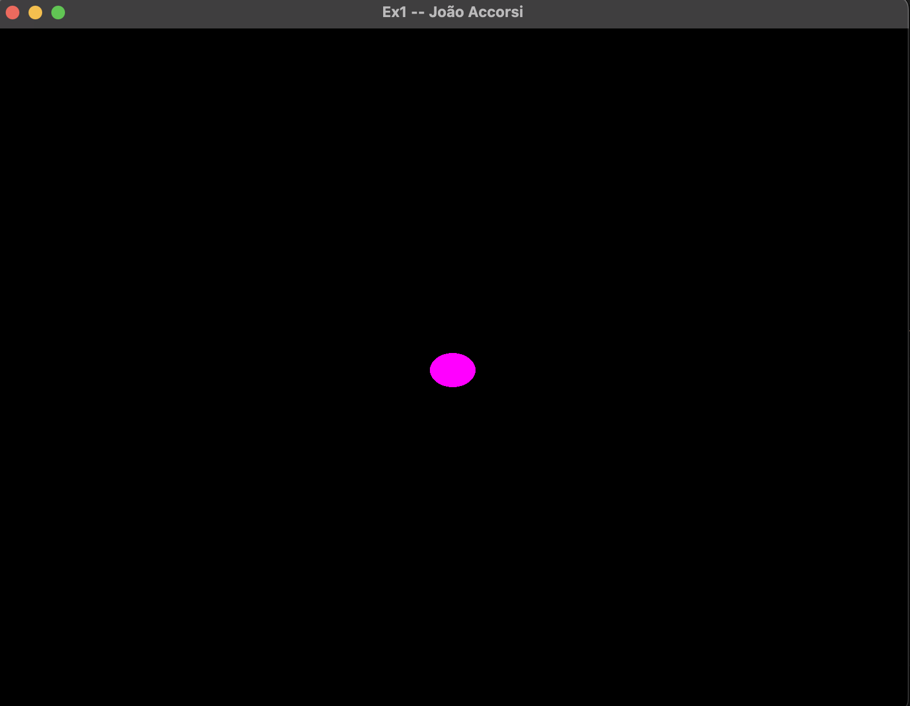
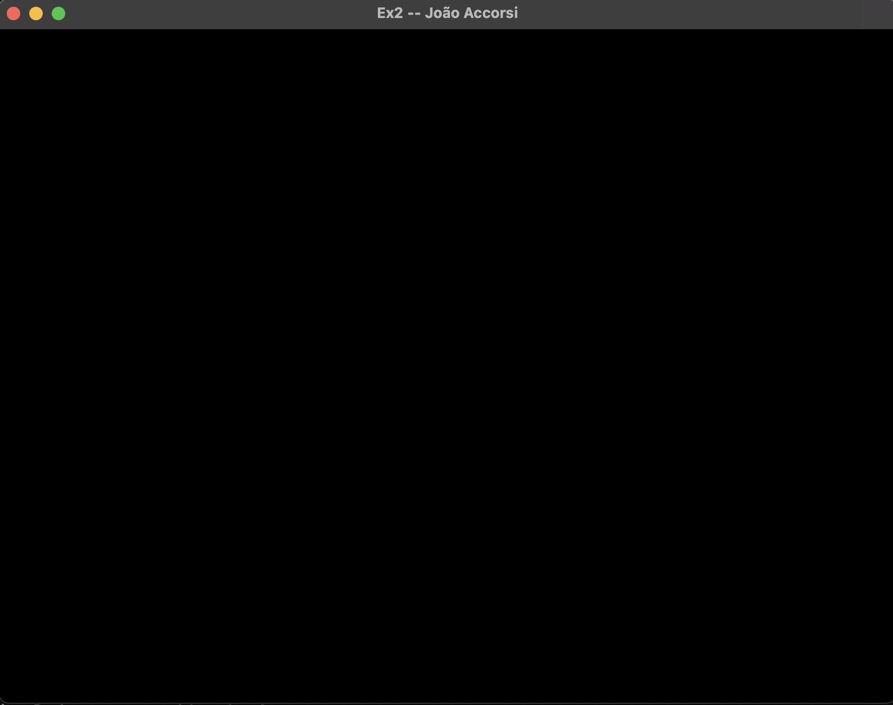
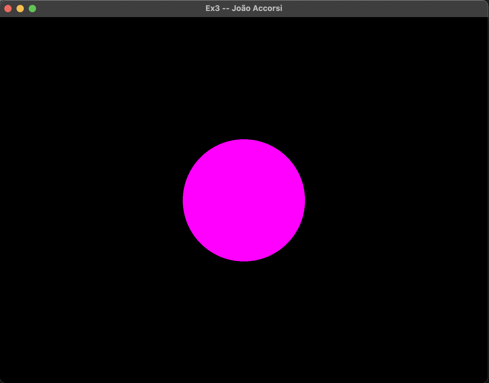
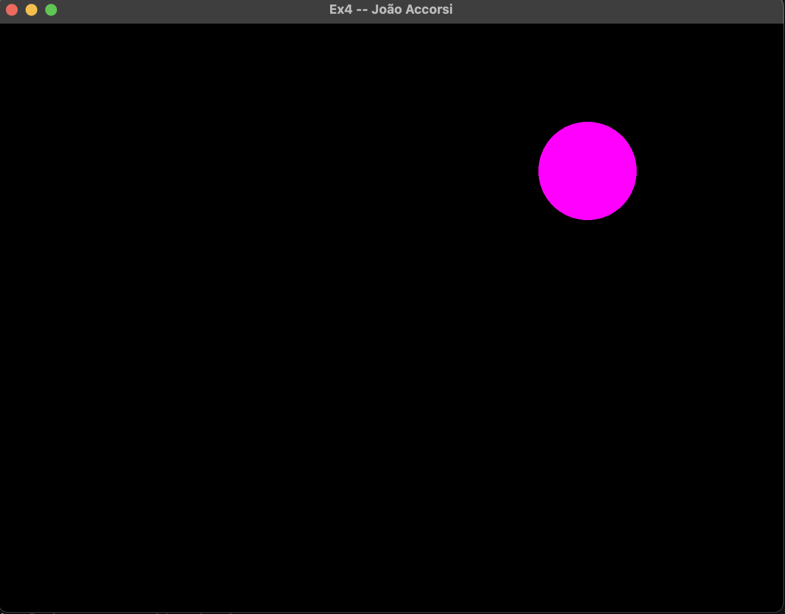
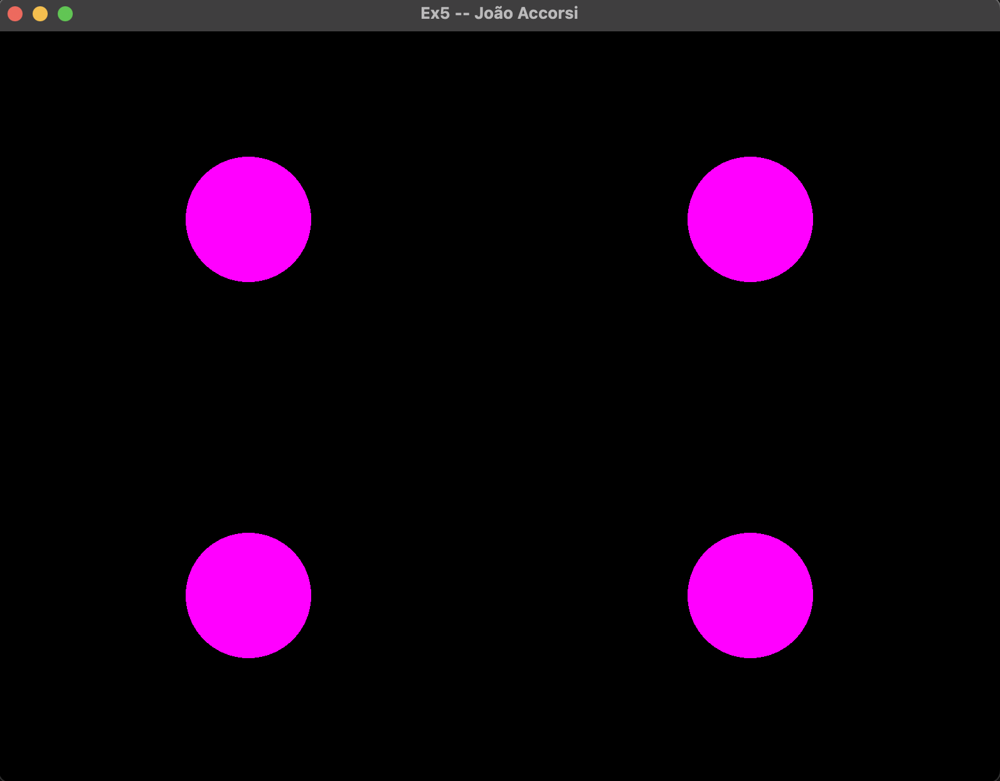

## Exercise 1

  
## Exercise 2

  
## Exercise 3
This configuration is useful to properly determine the values of x and y. So, it is possible to set up in the viewport the objects more precisely.

  
## Exercise 4
glViewport(width / 2, height / 2, width / 2, height / 2);

  
## Exercise 5
glViewport(0, 0, width / 2, height / 2);
glViewport(width / 2, 0, width / 2, height / 2);
glViewport(0, height / 2, width / 2, height / 2);
glUniform4f(colorLoc, 1.0f, 0.0f, 1.0f, 1.0f); 
